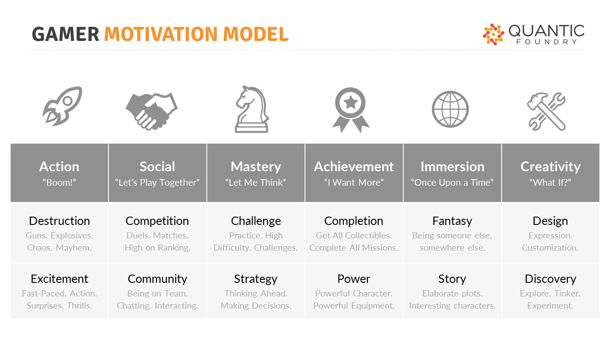

# Playtesting

## Playtesting

Testing is an essential part of any **agile development**, especially game productions. Testing takes place during each **sprint** of agile development and of all the types of testing the **playtest** is by far the most important in **player-centric design**.

### Player Experience Goals 

A **Playtest** assesses if the game is meeting the **player's experience goals**. The player experience goals relate to the player's motivation in the game and what the player will do and feel throughout the game.

Playtests should help game designers answer certain questions about the game, such as:

* **Is it playable?** Does it function as intended or as the player perceives it should?
* **Is it enjoyable?** Would the players play it again? Does the player consider it fun?
* **Is it challenging?** Does it motivate players to complete? Is there the right amount of risk and reward?
* **Is it engaging?** Does it evoke a certain emotion and behavior in the player?
* &#x20;**Is it balanced?** Are the outcomes perceived to be fair and consistent? Are there no unintended outcomes?
* &#x20; **Is it Accessible?** Are all game elements understandable and complete?    &#x20;


Remember the **game designer is not always part of the target market** for the game but regardless they must be an advocate for the player.


#### **Target Players**

The player-centric design is all about the player, with that said to properly playtest a game, game designers need to identify **target players (market)** for the game.

**Market Segmentation**

While it would be amazing to say that your game is intended for everyone, it is impossible to design for everyone. Instead, game designers need to identify a narrow representation of their **ideal player** defining each of the 4 types of market segmentation:

* **Demographics**: age, gender, income, location, education, ethnicity
* **Psychographics:** personality traits, values, attitudes, interests, lifestyles, motivations
* **Behavioral:** purchasing habits, spending habits, brand/platform interactions
* **Geographic:** country, climate, urban or rural     &#x20;

Each of the segmentations provides helpful information about your player and why they would or would not play your game. For example, if your game requires many in-game purchases to be able to level up, those from lower-income families may be unable to continue playing the game, long-term.  If your game portrays certain morals or values in contrast to the player, they may find it offensive. If the game is developed as a PC-only game, console players may not even consider trying it. Certain countries ban certain depictions in media. For example: In Germany, all depictions and imagery of the swastika are illegal. Thus, a World War II game, for instance, may have to be modified or not sold in Germany.

**Player Personas**

One method for game designers to help identify the ideal player is to create a **player persona**. A persona in marketing is a fictional representation of an actual user (player).

During the early stages of the game production, a persona is prepared as a one-page description that identifies all of the market segmentation of the individual based on data gathered from actual people representing your target player.

[**Quantic Foundry**](https://quanticfoundry.com/) a marketing research company focused on gamer motivations, developed the Gamer Motivation Model based on data from over 400,00 video gamers. This model represents **6 key pairs of motivations** by game players and can be used as a starting point for creating a player persona.

<figure><figcaption>
Quantic Foundry - Gamer Motivation Model
</figcaption></figure>

Once completed the player persona will be used throughout the development to help the entire game production team make informed decisions when designing, building, and testing the game.

ACTIVITY: Player Personas

#### Activity Time: 15 Minutes

## Learning Objective 

This activity is designed to help students identify the ideal player for a game, by way of creating player personas.

### **Collaborative Learning Methods**

#### **Traditional Course**

Students are to complete step 1 and then share their list with the rest of the class. Through group discussion, students will complete step 2.

#### **Online Course**

Students will complete step 1 as a post then reply to at least two other students' posts as part of part two.

## Overview

Designing a game for everyone is impossible. All players have different likes and motivations. By using player-centeric design, game designers ensure a certain type of player experience with a game and that all your design decisions are made to meet the needs of the specific player.

Who is this player? As early as possible, sometimes even before generating game ideas, the game design team should define their player, by way of making a player persona.

## **Direction**

1. &#x20;Choose an existing game and one that all members of the group are familiar with.
2. Create a player persona using the following template
3. Discuss/Reply to students' lists
   1. Reply to 3 other posts commenting on their response.
   2. Do you feel their persona fits the game? Why or why not?

### Playtesters

Just as playtesting should take place during each sprint of the game production, there are different groups of playtesters; who should be playtesting.

1. **Self-Testers** – the game production team should playtest frequently and often. These playtest help identify any major red flags before they become a larger issue. However, these playtests may have biased results since those who playtesting are the same individuals on the game production team.
2. **Friends & Colleagues** – Once the self-testing has been deemed sufficient, friends and colleagues should be asked to playtest. This will provide feedback from an unbiased (or mostly unbiased) opinion. These individuals are not always your target market but can still provide vital feedback on issues before you share the game with your target market.
3. **Target Market** – To fully assess the potential success of your game playtest with your target market is essential. These strangers should provide you with 100% unbiased feedback.&#x20;

#### **Testing Prototypes**

Playtesting should take place as early as possible in the game production, starting with the physical prototype. Keep in mind different groups of playtesters should be invited to playtest during different steps of physical prototype development.

The chart below illustrates when and who should be playtesting your physical prototype

<table data-header-hidden><thead><tr><th width="328"></th><th width="135" align="center"></th><th width="149" align="center"></th><th align="center"></th></tr></thead><tbody><tr><td> </td><td align="center"><strong>Self-Testing</strong></td><td align="center"><strong>Friends &#x26;</strong> <strong>Colleagues</strong></td><td align="center"><strong>Target</strong>  <strong>Market</strong></td></tr><tr><td> <strong>Prototype Development Steps</strong></td><td align="center"></td><td align="center"></td><td align="center"></td></tr><tr><td>Step 1  - Laying the Foundation</td><td align="center">X</td><td align="center"> </td><td align="center"> </td></tr><tr><td>Step 2- Building the Framework</td><td align="center">X</td><td align="center">X</td><td align="center"> </td></tr><tr><td>Step 3 - Adding the Finishings</td><td align="center"> </td><td align="center"> </td><td align="center">X</td></tr><tr><td>Step 4 - Refinement</td><td align="center"> </td><td align="center"> </td><td align="center">X</td></tr></tbody></table>

### Conducting Playtests

Depending on the stage of the game production and the type of feedback data the game designer is seeking, different types of playtesting methods might be employed.

The methods of playtests can vary, therefore it is important to first identify the types of feedback data that game designers are seeking answers for. The following video by _Extra Credits_ provides an overview of how to get good feedback on your game.


How to get good feedback on your game


#### **Methods of Playtesting**

There are many ways to conduct playtests each having its pros and cons. The most common methods of playtesting are through:

* **One-on-one -** observe and ask questions of each playtester as they play the game. This can provide insight into how the player plays the game but can also be skewed if the players are nervous or distracted by the observations and questions.
* **Group Testing –** observe and ask questions of a group of playtesters as they play through the game all at the same time and place. This can provide helpful observation data in a greater sum, but again players may be uncomfortable or distracted during the observation and questioning process.
* **Feedback Forms –** Have the playtesters play the game independently and submit feedback through a survey. Quantitative data on feedback forms relay on asking the right questions, while qualitative data depends on the articulation and willingness of the playtester.
* **Interviews –** Interview playtesters individually after they have played the game. Much like feedback forms, quantitative data depends on how the interview questions are asked and qualitative data depends on how verbal the playtesters are.
* **Open Discussions –** Have an open discussion with a group of playtesters after they have played the game. Open discussions can stimulate conversation among playtesters, in contrast to the interviews. However, there may be playtesters unwilling to share their opinions amongst a large group.
* **Metrics –** Collect in-game data about the player's gameplay behaviors. Metrics can collect a great amount of data on how the player unconsciously plays the game. However, this method of playtesting can only be implemented once a digital prototype is created.&#x20;

There are many ways to conduct playtests each having its pros and cons. The following video from _Brackeys_ provides another perspective of how and when to playtest.


How to playtest


#### **Playtest Sessions**

Regardless of which method of playtesting is being utilized the actual playtesting sessions should consist of the following:

1. &#x20;**Introduction –** Provide a brief overview of the playtesting process
2. **Warm-Up –** ask the playtesters questions about their current gaming background and preferences.
3. &#x20; **Play Session –** have the playtesters play the game. The length of the play session depends on the game, but usually between 15-20 minutes and no more than an hour at a time.
4. &#x20;**Game Experience –** obtain the data about how the playtesters perceived the game experience.
5. **Wrap-up –** always thank playtesters and show that you value their input. &#x20;

ACTIVITY: Play Matrix

#### Activity Time: 10 Minutes

## Learning Objective 

This activity is designed to help students identify where games fall along with the context of skill and chance.

### **Collaborative Learning Methods**

#### **Traditional Course**

Students are to complete step 1 and then share their list with the rest of the class. Through group discussion, students will complete step 2.

#### **Online Course**

NA.

## Overview

Developed by Game Designer, Tracy Fullerton, the play matrix can help playtesters give context to the game discussion. The horizontal axis of the play matrix is divided between skill and chance. The vertical axis is divided between mental calculation and physical dexterity.

By asking playtesters to plot the game on the play matrix, helps game designers if the game is meeting the player experience goals they intended.

### **Direction**

1. As a group come up with 6 or more games you’ve played & plot them on the play matrix
   1. As a group come up with 6 or more games you’ve played & plot them on the play matrix
2. Discuss/Reply to students' lists
   1. Reply to 3 other posts commenting on their response.
   2. Were there any similarities? Did some place the same game in different places?

### Playtest Data

As mentioned above the methods of playtests can vary, therefore it is important to first identify the types of feedback data that game designers are seeking answers for.

Here we identify the playtest criteria types, which aim to answer specific questions.

1. **Concept Testing –** Is it playable?
2. **Scattershot Testing -** Is it enjoyable?
3. **Experience Testing –** Is it engaging? Is it challenging?
4. **Stress Testing –** Is it balanced?
5. **Accessibility Testing –** Is it accessible, does it make sense and complete?

These different types of playtests are conducted during different stages of the game production and can be administered separately or as a whole playtest, depending on the needs, timeline, and budget of the game production.


**Quantitative vs Qualitative Data**

**Quantitative** data provide numerical data that can easily be measured. **Qualitative** data on the other hand represents opinions or feelings, which can not easily be represented numerically.

Both quantitative and qualitative data are equally important in playtesting. Quantitative data can help identify overall issues with a game and qualitative data can provide insight as to why players had certain issues with the game.


#### &#x20;**Collecting Playtest Data**

Playtest data is collected a different times during the playtest session, which includes:

* &#x20;**In-Game -**  this data is recorded while the testers are playing the game. This can include observations notes taken of the playtesters or metrics recorded about their gameplay.
* **Postgame –**  this data is recorded immediately following the play session. These questions are designed to help elicit opinions about the key aspects of a game system.
* **Reflection –** this data is recorded after the playtester, and formulated by the game designer to quickly reflect on what revisions should be made to the game.


**Taking Notes**

Note-taking during playtests is very important. Game designers should always take notes during the playtest session, these notes can help provide some context to the playtest data.


#### **Formulating Playtest Questions**

To collect playtest data, game designers need to be asking the right questions. However, it is not as simple as just asking players if the game is playable? This type of question is open-ended. To what extent is the game playable? Was the player able to complete or achieve the goal. And for that matter are we even sure the player understood the goal?

Game designers should break each of their player experience goals, into smaller more direct, and defined questions. Breaking these questions into sections based on game mechanics, gameplay, and core mechanics. Questions should also vary depending on the playtest criteria types.

#### **Analyzing the Data**

Once a playtest is conducted it is important to review and analyze the data. Every game production team will have their own method for evaluating the playtest data. The most prominent elements which the playtest data should identify are:

* Which elements of the game are most praised?
* Which elements of the game are most disliked or confusing?
* &#x20;What can you do to highlight or improve these elements?&#x20;

Each time a playtest is conducted more data will help to illustrate a better picture of the direction the game is taking and whether or not the game is getting closer to or achieving the intended player experience goals.

#### **Refinement**

Once the playtest data has been reviewed it is time to evaluate and refine the game based on the feedback. During the refinement stage, the game production team should identify which elements, features, and functions must be refined, eliminated, or let be.

The rule of thumb is to work based on the majority of the data. For example, if the data indicates that all or most playtesters voiced a complaint about the jumping feature in the game, then that is a feature that must be examined and revised. However, if there was a minor few who shared a complaint about the organization of the inventory screen, that might be an element to let be for now and perhaps re-evaluate later down the road.

Regardless of what direction the game production team takes with the playtest data, this data should be valued and help the game production team as they move closer towards their goal of developing a game that meets their player experience goals.
