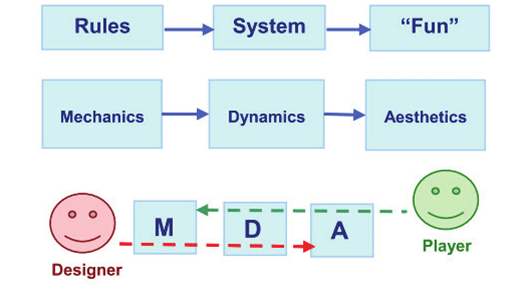
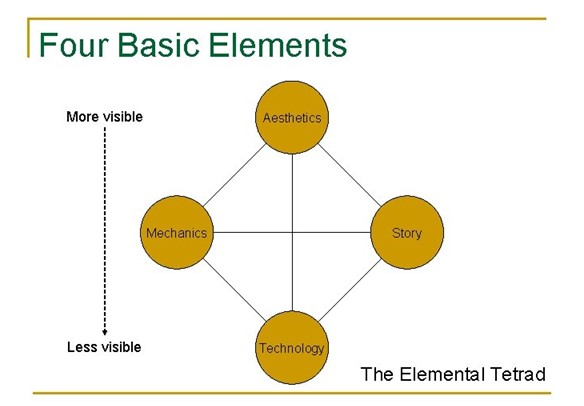

# Game Frameworks

**Ludology** is the study of games. Over the years ludologists have proposed various analytical frameworks for games to help understand and discuss the structure and fundamental elements of games.

## Popular Frameworks

While there have been several attempts at defining this framework, the most widely cited frameworks include:

•     **MDA** – Mechanics, Dynamics, Aesthetics (Robin Hunicke, Mark Leblanc, and Robert Zubek)

•      **Elemental Tetrad** – Mechanics, Aesthetics, Story and Technology (Jesse Schell)

•      **Formal, Dramatic, Dynamic Elements** (Tracy Fullerton and Chris Swain)

### **Mechanics, Dynamics, Aesthetics**

The MDA framework breaks apart a game into the following categories

* **Mechanics** describes the components of the game, at the level of data representation and algorithms.  (_ie. The Rules for the game_)
* **Dynamics** describes the run-time behavior of the mechanics acting on player inputs and each others' outputs over time. (_ie. How the game is played_)
* **Aesthetics** describes the desirable emotional responses evoked in the player when she interacts with the game system _(ie. The player experience)_

According to the MDA framework designers and players view games from different directions. Far too often designers start with the mechanics of a game (what do we know how to build) instead of considering the aesthetics (what the player should experience).

MDA framework designers should first approach a game by deciding on the player experience (aesthetics) and then work backward to create the dynamics and mechanics that fit the chosen aesthetics.

<figure><figcaption>
MDA framewok
</figcaption></figure>

### &#x20;**Elemental Tetrad**

Jesse Schell extended upon an revised the MDA by additionally looking at technology and story.  Schell arranges these elements into a tetrad which shows how all elements interrelate to each other and to which are most visible to the player.

These elements include:

* **Mechanics** – rules for interaction
* **Aesthetics** – how the game is perceived by the senses.
* **Technology** –the underlying technology that makes the game work
* **Story** – all dramatic elements of a game, not just “story” but the characters, premise, challenge, and play

<figure><figcaption>
Elemental Tetrad proposed by Jesse Schell
</figcaption></figure>

### **Formal, Dramatic, Dynamic Elements**

Developed by Tracy Fullerton and Chris Swain the **Formal**, **Dramatic** and **Dynamic** elements were designed to help game design students by further breaking down the individual elements of a game.

**Formal elements** are the elements that provide the basic game mechanics. Without these elements, the game would not function and be ultimately unplayable.

The formal elements include:

* **Players** – individuals playing the game
* **Objectives or Goals** – what the player must strive to accomplish
* **Procedures** – steps to playing the game
* **Rules** – what the player can and cannot do
* **Resources** – game assets that aid the player
* **Conflict** – the obstacles that the player encounters
* **Boundaries** – the limitations to what the player can do
* **Outcomes** – a winner, looser or draw

The **dramatic elements** of a game are what engage the player emotionally and keep the player invested in playing the game. These elements include:

* **Challenge** – creates tension for the player
* **Play** – the ability for players to play (mess about) within the game system, bending the rules sort of speak.
* **Premise** – the concept behind the game story. Some games only have a premise
* **Story** – takes the premise further and enriches the game experience
* **Characters** – provide players a way to empathize with the story

**Dynamic elements** are those that occur only when the game is being played.

* **Emergence** – simple rules that can lead to unexpected outcomes based on the player’s actions. The player may do things that were unanticipated by the designer and may result in these unexpected outcomes.
* **Emergent Narratives** – a narrative that is not written into the game but emerges from the player's interactions with other players and the game systems.
* **Playtesting** – playtesting reveals information about the various dynamic behaviors that a game could have and helps designers understand the range of experiences that could be generated by their game.

**Game systems** are the set of interacting or interdependent elements forming the working game. These elements work with this closed system, engaging players in structured conflict and resolving its uncertainty in an unequal outcome.

When thinking about the elements of games remember that games are given **structure by their formal elements** and emotionally **engage the player by their dramatic elements**.

There are a few other requirements in games that do not specifically fall into the formal or dramatic elements list. These are not individual items in the game, but rather a sub-system that works inside the game.

### **MED Framework**

While each of the described frameworks provides a different perspective for understanding games. No one framework is universally followed.

With that said, Computer Simulation and Gaming Professor Akram Taghavi-Burris, has developed the MED framework as a combination and expansion of ideas presented in all of the previous frameworks. The MED framework consists of:

* **Game Mechanics** refers to the elements that make the game functional
* **Player Engagement** refers to the elements that make the player want to play the game
* **Game Dynamics** refers to the overall system and how it can be influenced by the mechanics and the players

You can also look at these classifications:

* **How** – how does the game work
* **Why** – why should the player be playing
* **What** – what happens during gameplay

## Analyzing Games

Critically analyzing games affords us the opportunity to explore games as systems and how each part of the system interacts and how these interactions affect the player experience. Understanding the game frameworks provides a common dialog and basis for conducting game analysis.&#x20;

### **Game Analysis VS Game Reviews**

A **game analysis** focuses on game design theories and practices, identifying design obstacles, and if the gameplay is meeting the **player's experience** goals. The **player experience** goals relate to the player's motivation in the game and what the player will do and feel throughout the game.

In contrast, a **game review** is a critical review from the perspective of a consumer, defining the market worth of the game, i.e., should you buy this game?

Whether you are an aspiring game designer, software developer, or anything else for that matter, you need a way to **showcase not only your work but also, your understanding and passion for the industry**, writing periodic game analysis is one way to demonstrate this.&#x20;

ACTIVITY : Connect the Dots 

**Activity Time: 15 Minutes**

## Learning Objective 

This activity is designed to help students identify the basic structure of games, by their formal and dramatic elements.

### **Collaborative Learning Methods**

#### **Traditional Course**

Students are to complete this activity in pairs. Each member of the group should participate and display a positive attitude.

#### **Online Course**

NA

### Overview

When thinking about games, consider what makes a game different from play. What elements are required for a game to be playable?

### **Direction**

For this activity, you will need a piece of paper, two pens, and two players.

1. &#x20;Play Connect the Dots
   1. Draw three dots randomly on the paper. Choose a player to go first.
   2. The first player draws a line from one of the dots to another dot.
   3. Then that player draws a new dot anywhere on that line.
   4. The second player also draws a line and a dot.
      * The new line must go from one dot to another, but no dot can have more than three lines coming from it.
      * The new line cannot cross any other line
      * The new dot must be placed on the new line
   5. The players take turns until one player cannot make a move. The last player to move is the winner.
2. After playing the game, each pair discuss and answer the following questions:&#x20;
   * **Players:** How many? Any Requirements? Special Knowledge, roles, etc?
   * **Objective:** What was the goal of the game?
   * **Procedures:** What are the required actions for play?
   * **Rules:** Any limits on the player action? Behavioral rules?
   * **Conflict & Boundaries:** What causes conflict in this game? Are they physical? Conceptual?
   * **Outcome:** What are the potential outcomes of the game?
   * **Challenge:** What creates the challenge in the game?
   * **Play:** Is there a sense of play within the rules of the game?
   * **Premise/Character/ Story:** Are these present?
3. Discuss/Reply to students’ responses to this activity

## Game Design Terms

Game designers need to be able to speak the lingo of the industry. They need to be able to understand how games are a system, the elements of that system, and the basic terminology used for describing certain aspects of the system.&#x20;

The following is a list of the most common terms and common definitions of those terms used in game design and development.

* **Game Mechanics** are a synonym for the “rules” of the game. These are the constraints under which the game operates. How is the game set up? What actions can players take, and what effects do those actions have on the game state? When does the game end, and how is a resolution determined? These are defined by the mechanics. ( [_MDA Framework_](http://www.cs.northwestern.edu/\~hunicke/MDA.pdf) by LeBlanc, Hunicke, and Zabek.)\
  \
  **Game mechanics** can be further defined as the construct of all formal elements, predominantly the **rules** and **procedures**, intended to produce enjoyable **gameplay**.\
  \
  Key elements of game mechanics are **interaction** and **challenge** and as such video games are sometimes referred to as **interactive challenges**.\

* **Core mechanics** are the repetitive game actions the players perform within the game to achieve the goal.  For example, the main actions of the game may be to duck and jump to avoid obstacles and navigate through the game.\

* **Player Engagement** is the level of continuation desire experienced in-game. Good player engagement is made possible through **dramatic elements** and **aesthetics**. Engagement is an essential element of the player experience.\

* **Gameplay** consists of all **player experiences** primarily the **challenges**, **choices**, and **consequences** that the player faces within the game.\

* **Gameplay Dynamics** refers to a system where one action has a range of influences on **gameplay**. Using this definition one can easily come up with examples of gameplay dynamics that have a large effect on a game's gameplay and other examples that have a very small effect. Dynamics that are much more common and that affect a significant amount of the gameplay elements are called core **gameplay dynamics** or **core dynamics**.\

* **Emergent gameplay** is created from the freedom of play and the limitations and player choices/strategies. **Gameplay dynamics** are what make **emergent gameplay** possible.\

* **Game Aesthetics** is the sensory phenomena that the player encounters in the game (visual, aural, haptic, embodied). Game aesthetics can also be defined as those aspects of digital games that are shared with other art forms (and thus provides a means of generalizing about art). Game aesthetics is an expression of the game experienced as pleasure, emotion, sociability, form-giving, etc (with reference to ”the aesthetic experience”).\

* **Game Atmosphere** is the cohesion of artwork, audio, narrative, and level design that helps create the desired player experience. The game atmosphere provides context for the overall mood and tone of the game.\

*   **Feedback** is the positive and negative response to the player’s choices (actions)

*   **Risk** is the chance of losing for greater gain.

*   **Reward** positive feedback for overcoming a challenge

*   **Balance** refers to the perception that the game is consistent, fair, and fun.

* **Game Theory** is the study of participants' behavior in strategic situations.\

* **Gamification** is the use of game design elements in a non-game context to encourage engagement and productivity\

* **Magic Circle** is the temporary world in which a game takes place. This is where pretend comes into games, and the player must be willing to pretend or in other words, buy into the rules of the game.\

&#x20;
