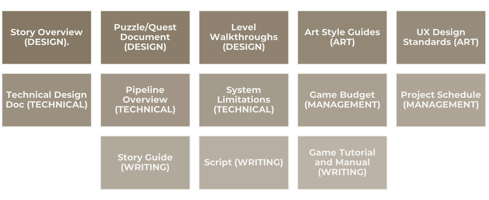

# Game Documentation

An essential part of any game production is game documentation. Good **game documentation** is ensuring that everyone working on the game production is on the same page and working towards the same goals. These documents serve two purposes:

* Memory aid
* Communication tool

The most crucial game document is the **Game Design Document** or **GDD**.  The GDD is comprised of several documents that are revised during each phase of the development process and includes the following information:

* The core idea of the game
* Team tasks and timeline
* The game atmosphere (mood & tone)
* The goal of the game
* Plan for implementation

Throughout the stages of the game production, the GDD evolves into a variety of different types of documents these include:

<table><thead><tr><th width="201">Document Title</th><th width="392">Description</th><th width="152.33333333333331">Phase</th></tr></thead><tbody><tr><td>Concept</td><td>A brief overview of the target platform, key game features and gameplay</td><td>Concept</td></tr><tr><td>Proposal (Project Plan)</td><td>Includes market analysis, profit and loss statements, and technical analysis. [Used as contract]</td><td>Concept</td></tr><tr><td>Design Doc</td><td>Describes character, level design requirements, gameplay mechanics, user interface, music, and audio requirements. </td><td>Pre-Production</td></tr><tr><td>Style/Standards Guide</td><td>Lays out the design strategy and tools used to create the game, sets the standards for all assets, code, and the version control system.</td><td>Pre-Production</td></tr></tbody></table>

Other documents that are typically developed in a game production include:

<figure><figcaption>
Other common game documentation
</figcaption></figure>

## **Rules for Good GDD**

When writing a good GDD it is important to follow these rules:

* Know your target – who are you writing this version of the document for? Your development might need more technical details provided while the publishing team is less concerned about the actual development, but more so on costs and gains.
* Keep it short – Nobody has time to read a ton of pages, keeping the documents short and well organized will help everyone stay abreast of the details and easily find the information they need to get their task done.
* &#x20;Prioritize the design – focus on the overall design of the game. Development details will change over time.
* &#x20;Illustrate – Pictures are worth more than words. Whenever possible use images, even reference art to illustrate what you are aiming for.
* Don’t micromanage – while it is important to stay time on task, things change, and the development/design team needs to be able to release their creativity on the project.
* Use user stories – get feedback from playtesters to help illustrate how and why the game will succeed.
* Separate code from content – going back to knowing your audience, keep the technical information separate from the overall content of the game.
* Invest in a good format – Use a format that works for everyone on your team.
* Use clear terminology – To ensure everyone is referring to the same thing, use clear and consistent terminology for documentation. For example, does the game use gold or cash, these could both be in the game, so you will have to set guidelines as to when and where each term should be used.
* Kill redundancy – do not keep repeating the same information in different documents, keep things short, clear, and precise.
* &#x20;Avoid weak language – show your drive to succeed, but use language such as “we will” instead of “we hope”.
* Capture your reasoning – provide an explanation for choices and direction

## Writing Game Design Documents&#x20;

Traditionally GDDs were written as rigid Word documents, attempting to needlessly explain every detail of the game only to never be updated or read by anyone, and have since been made obsolete.&#x20;

Game Designers today create GDDs as **living documents** that are updated throughout the project and have been adapted to support the creative, iterative, and collaborative process of game development

### Game Design Document Wikis

Many GDDs are writing using a **wiki platform**. A wiki is a collaborative tool that allows users to contribute and modify one or more pages of related materials. Wikis offer bite-size pieces of information; each Wiki page is a topic, and it can easily be linked to other topics, grouped into sections, and labeled for searching. In short, **Wiki makes GDDs more accessible**.

Triple AAA game companies often host their own server for the GDD wiki, and while that is not always an option for smaller independent game studios, there are free alternatives. One of the best options is to make use of the Project Wiki that is included in each **GitHub Repository**. &#x20;


A **GitHub repository** can be taught as a single development **project**. Inside the repository, are all of the project files. GitHub is primarily used for version control and this is made possible by storing project files' revision history. At any point in the development collaborates can revert to previous versions of a project in the repository.&#x20;

