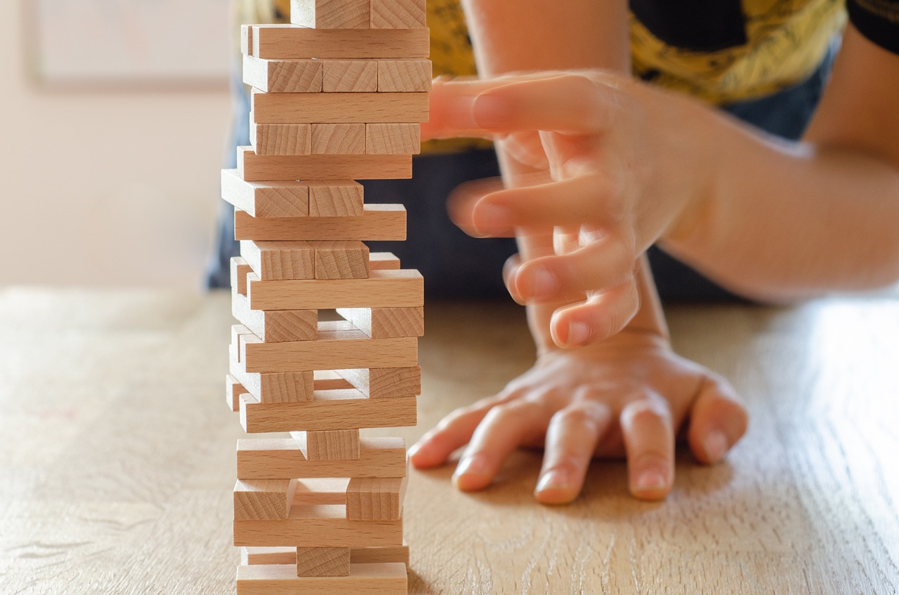

# Game Objectives

When designing a game, game designers often start by defining the game's objective. The game objective is another way to help categorize different types of games. Game objectives sometimes go hand-in-hand with game genres, so much so that there are often player expectations that certain objectives say exploration for example will always be an objective of a game in the adventure genre. &#x20;

## Types of Objectives

When categorizing games by objectives we look at the actions players must complete to achieve their objectives. The most common actions are as follows.

### Race

The **race objective** entails competing with others to see who is the fastest at reaching the objective. This might be the first one to the finish line or the the first player to complete a series of tasks.&#x20;

<figure><figcaption>
Race objective is typical for racing genre games
</figcaption></figure>

The race objective is commonly found in **racing games**, however, casual games such as board games could also make use of the race objective, where the game objective is to be the first to make it around the board.&#x20;

The race object could require skill to master the objective in a given time or simply chance as in most board games.&#x20;

### Collect

Games with a **collection objective** has the player collect or acquire items in the game. Items to collect are typically game **resources**, such as currency, health, space, time, etc.&#x20;

Resources as a game mechanic should have both utility and scarcity, their utility makes the valuable their scarcity makes it a challenge to find.&#x20;

Many **strategy games** require players to collect the most units on the board.  The collection objective is also a common sub-objective for many games.&#x20;

### Rescue or Escape

A **rescue** or **escape objective** involves getting one's self or team to safety. Games like _Super Mario Bros._ have the main objective of rescuing the Princess, while in the game _Hades,_ the main objective is to escape the Underworld. Both games also include sub-objectives that help move the player forward while moving forward toward their rescue or escape.&#x20;

<figure><figcaption>
Escape and rescue objective games often include sub-objectives
</figcaption></figure>

### Capture&#x20;

Capture objective entails taking something away or destroying something from your opponent while eluding capture. Checkers is a great example in which players capture their opponent's pieces throughout the game to move forward.&#x20;

Many popular shooter games have incorporated **capture-the-flag** modes into the game, in which teams battle to capture the opposing team's base.&#x20;

### Construct

The **construct objective** centers around the player constructing, managing, or maintaining something.&#x20;

<figure><figcaption>
Construct objective has the player build something
</figcaption></figure>

Construct objectives can often be found within **simulation games**. Games like _Minecraft, SimCity,_ and _Animal Crossing_ are great examples of simulation games with a construct objective. However, construction could also be an objective of **strategy games.**&#x20;

### Solve or Outwit

The **solution objective** is to deduce the solution to a puzzle or problem before other players or within certain time constraints.&#x20;

Solving the answer can also be a matter of simply **outwitting** your opponents since the answer required knowledge obtained either inside or outside the game. Trivia games are a good example of an outwitting objective.&#x20;

### Explore&#x20;

Exploration is an objective often associated with **adventure games**, where the focus is to explore unknown areas of the game.&#x20;

<figure><figcaption>
Exploration objectives are typically associated with adventure gams
</figcaption></figure>

The objective of exploration alone is often accompanied by other sub-objectives such as collecting specific items as you explore. In some instances, exploration could be a sub-objective to the main objective of a rescue.&#x20;

### Alignment

The **alignment objective** focuses on getting things in the right order or pattern. Alignment is the most common objective of a **puzzle game**. Some perfect examples of alignment games include Tetris and Bejeweled.&#x20;

### Forbidden Act

Not breaking the rules is the objective of a **forbidden act** game. Games like  _Twister_ or _Jenga_ are examples of games in which making the wrong move is a forbidden act that will cost you the entire game.&#x20;

<figure><figcaption>
Jenga is an example of a forbidden act game
</figcaption></figure>

Games with a forbidden act objective often require physical flexibility or simply chance. Due to the physical nature of this objective, it has not been very prominent in digital games until the recent use of certain types of controllers. For example, Nintendo's Wii Fit game made use of the Wii board and in many of their mini-games the player was required to have near-perfect balance to maneuver, otherwise, you would invoke the forbidden act of touching the edge or falling off.&#x20;

## Designing Objectives

When designing a game it is important to first identify the main objective of the game. After which game designers should develop a series of **sub-objectives** that help guide the player towards the end goal but also provide a sense of progression, as well as helping to establish player engagement.&#x20;
