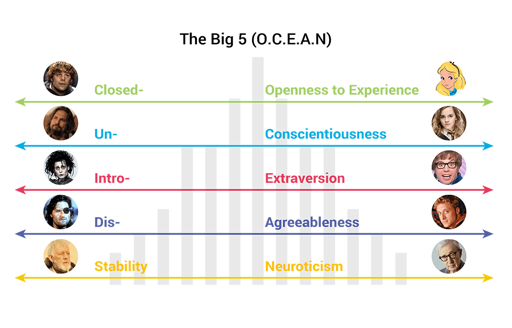
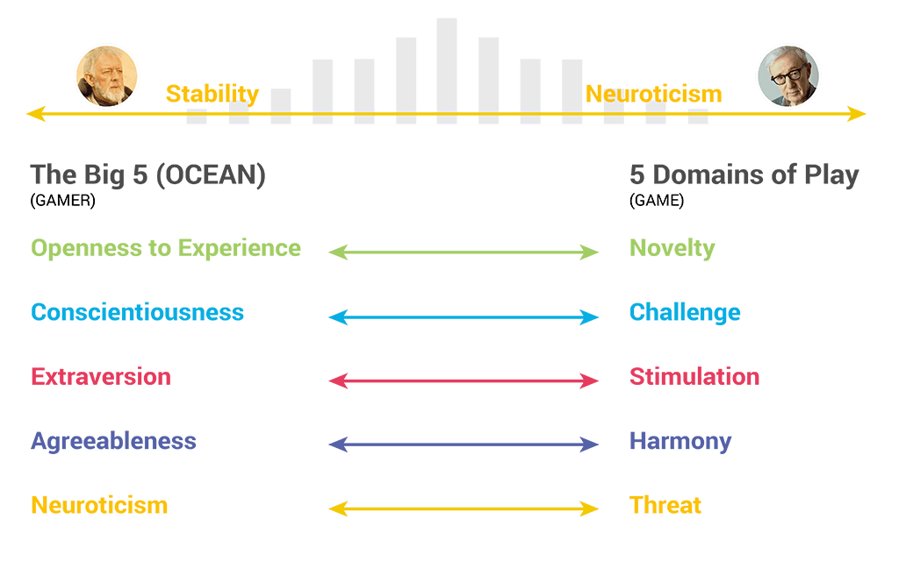

# Play

**Play** is defined as taking part in an enjoyable activity for the sake of amusement. Play can be thought of as the freedom of players to act within rigid constraints of a game to allow the opportunity for emergent experiences and personal expression What are the rigid constraints of a game; the rules and procedures.&#x20;

Paper Telephone

## Pleasures of Play

An enjoyable activity can also be interpreted as **pleasure**. As game designers, we need to understand what gives pleasure to the player. Note that not everyone is pleased with the same things.&#x20;

To better understand players and their play needs, players were divided into categories by player types.&#x20;

## Player Types&#x20;

In 1996 Game Designer Richard Bartle developed a test to observe and define players in MMORPG and earlier MUD (Multi-User Dungeon) games.

The Bartle test narrowed players to 4 distinct player types: Killers, Socializers, Achievers, and Explorer.


what player type are you?&#x20;



Bartle's Taxonomy


### Expanding Player Types&#x20;

<figure><figcaption>
Different Player Types
</figcaption></figure>

According to game designer and author Tracy Fullerton, the following categories help to address the pleasures of play from the point of view of the player; and include:

* **Competitor** – plays to beat other players, regardless of the game
* **Explorer** – curious about the world loves to go adventuring, seeks outside boundaries physical or mental
* **Collector** – Acquires items, trophies or knowledge, likes to create sets
* **Achiever** – plays for varying level of achievement, ladders/leaders
* **Joker**- doesn’t take the game seriously plays for fa un
* **Artist** – driven by creativity, creation, and design
* **Storyteller** – loves to create or live in worlds of fantasy and imagination
* **Performer** – loves to put on a show for others
* **Craftsman** – wants to build , craft, engineer, or puzzle things out.

### OCEAN Model&#x20;

While the Bartle player types have been widely used in the game industry, Jason Vandenburgh, a creative director at Ubisoft Montreal, gave a talk in 2012 at the Game Developers Conference (GDC) and introduced their new model.


Applying the 5 Domains of Play


The **ocean model** also referred to as the **Big Five personality traits**, was developed by psychology researchers in the 1980s. Of these 5 personality traits individuals could fall on either end of the personality spectrum.&#x20;

<figure><figcaption>
OCEAN model. Credit by <a href="https://liftoff.io/">https://liftoff.io/</a>
</figcaption></figure>

Through research Vandenburgh determined that certain personality types favor certain type of play, which is coined as the 5 Domains of Play.

<figure><figcaption>
OCEAN = Domains of Play. Credit by <a href="https://liftoff.io/">https://liftoff.io/</a> 
</figcaption></figure>
